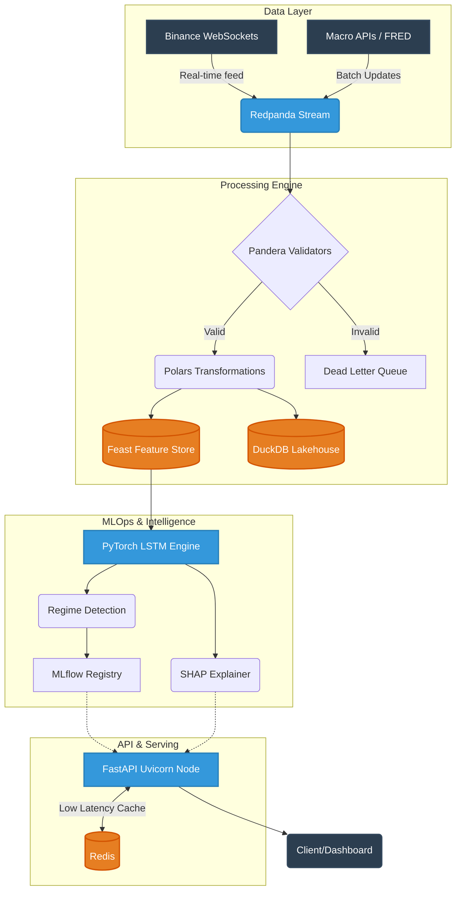
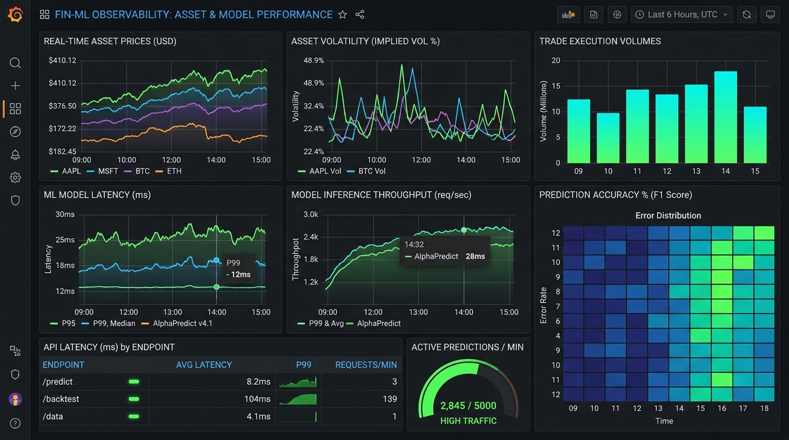

<div align="center">
  
  <h1>Macro Regime Analyzer (MRA)</h1>
  <p><strong>Enterprise-Grade MLOps Pipeline for Macroeconomic Regime Detection</strong></p>
  
  <p>
    <a href="https://github.com/AI-Autistic-Intelligence/macro-regime-analyzer/actions"></a>
    <a href="https://pytorch.org/"></a>
    <a href="https://fastapi.tiangolo.com/"></a>
    <a href="https://redpanda.com/"></a>
  </p>
</div>

---

> **Macro Regime Analyzer** is an advanced MLOps platform built to detect, classify, and stream macroeconomic regimes using real-time financial data. Designed for high-frequency environments, it leverages Deep Learning (LSTMs) for forecasting and Explainable AI (SHAP) for critical interpretability, all orchestrated within a distributed, Kubernetes-ready microservices architecture.

## 🚀 Key Features

*   ⚡ **Ultra-Low Latency Streaming:** Event-driven architecture powered by **Redpanda** (Kafka-compatible) and **Binance Websockets**.
*   🧠 **Deep Learning & XAI:** Temporal sequence modeling using **PyTorch LSTMs**, with real-time feature importance scoring via **SHAP**.
*   📊 **Lakehouse Analytics:** Fast vector operations with **Polars** and seamless analytical querying via **DuckDB**.
*   🛡️ **Data Contracts:** Enforced schema-on-read validation with **Pandera**.
*   🌐 **Distributed Background Workers:** **Celery** & **RabbitMQ** to handle asynchronous model retraining flows.

## 🏗️ System Architecture

The entire pipeline is built for resilience, throughput, and modularity. From data ingestion to inference, every component is decoupled.



## 📈 Observability & Monitoring

We believe that **you can't optimize what you can't measure**. 
The system features a comprehensive observability stack powered by **Prometheus** and **Grafana**, providing real-time telemetry on API latencies, machine learning prediction drift, inference throughput, and trade execution volumes.

<div align="center">
  
  <p><i>Live telemetry: Asset Volatility, API Endpoint Latency (P99), and Prediction Traffic.</i></p>
</div>

## 🛠️ Quickstart

Ensure you have **Docker** and **Docker Compose** installed.

1. **Clone the repository:**
   ```bash
   git clone https://github.com/AI-Autistic-Intelligence/macro-regime-analyzer.git
   cd macro-regime-analyzer
   ```

2. **Start the Infrastructure:**
   Spin up FastAPI, Redis, Redpanda, MLflow, Celery, Grafana, and Prometheus with a single command:
   ```bash
   docker-compose up -d --build
   ```

3. **Run the Real-time Ingestion:**
   Connect to Binance and start publishing to the Redpanda stream:
   ```bash
   python src/ingestion/websocket_client.py
   ```

## 🔒 API Endpoints

The core REST API is served on `http://localhost:8000`. 
Interactive Swagger docs: `http://localhost:8000/docs`.

| Endpoint | Method | Description |
|----------|--------|-------------|
| `/api/v1/auth/token` | `POST` | Get JWT Access Token |
| `/api/v1/predict/latest` | `GET` | Get the latest macro regime prediction (Redis Cached) |
| `/api/v1/predict/explain` | `POST` | Get SHAP values for real-time feature interpretation |
| `/api/v1/models/retrain` | `POST` | Trigger asynchronous Celery model retraining |

## 🧪 Testing & Linting

We enforce strict quality control. The project uses `Ruff` for lightning-fast linting and `Pytest` for anti-regression testing.

```bash
# Run Linter
ruff check .

# Run Tests
docker-compose exec macro_analyzer python -m pytest tests/
```

## 📁 Repository Structure

```text
.
├── src/
│   ├── core/         # Configs, Security (JWT), Exceptions
│   ├── domain/       # Pydantic Entities
│   ├── features/     # Polars pipelines and Feast Feature Store definitions
│   ├── ingestion/    # Binance websockets, Kafka Consumer, Pandera validators
│   ├── models/       # PyTorch LSTM, MLflow Tracker, SHAP Explainer
│   ├── serving/      # FastAPI Server, Routers, Dependencies
│   ├── storage/      # DuckDB Lakehouse, Redis Cache wrappers
│   └── tasks/        # Celery background workers (Model Retraining)
├── tests/            # Unit, Integration, and E2E (Hypothesis) tests
├── scripts/          # Stress testing scripts
├── k8s/              # Kubernetes manifests
├── docs/             # Technical documentation and assets
├── .github/          # CI/CD workflows
└── docker-compose.yml
```

---
<div align="center">
  <sub>Built with ❤️ for resilient financial engineering.</sub>
</div>
